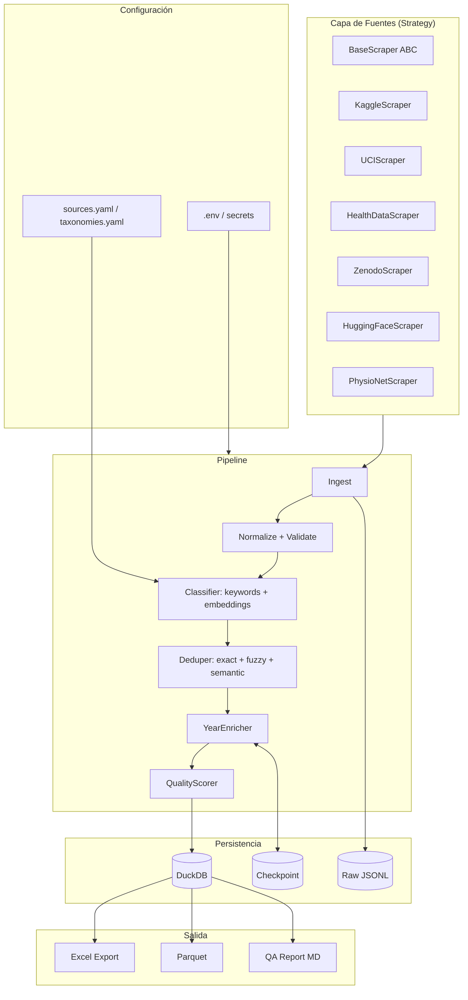

# Auditoría Técnica — CACIC SALUD

**Fecha**: 2026-05-23
**Auditor**: revisión técnica integral
**Alcance**: `cacic_salud.py` (1082 LoC), `DOCUMENTACION.md`, `requirements.txt`, logs de la última corrida

---

## 1. Resumen Ejecutivo

El proyecto cumple su función actual (consolidar ~1.400 datasets de salud en un Excel catalogado) y la decisión de unificar todo en un script tiene sentido para el alcance y el equipo (3 personas, contexto académico). Sin embargo, evaluado contra los criterios de un sistema de investigación que va a operar y crecer en los próximos 2-5 años, presenta **debilidades estructurales serias**:

1. **Credencial sensible commiteada al repo** (token de Zenodo en `cacic_salud.py:52`) — incidente de seguridad que requiere rotación inmediata.
2. **El enriquecimiento de "Año actualización" está roto en producción** — el log muestra 100% de errores en Kaggle (`error:HTTPError`) y 0% de cobertura en UCI/NHANES/CDC (`unsupported_source`). La feature existe pero no funciona.
3. **Clasificación por keywords ingenua** (scoring por conteo de substrings, sin word boundaries) que confunde mención con tema.
4. **Excel como fuente de verdad** introduce un cuello de botella: no permite consultas, ni versionado, ni multi-usuario.
5. **Sin tests, sin CI, sin contratos de schema** — cualquier cambio en una API externa puede romper silenciosamente el pipeline.
6. **Acoplamiento alto**: `CONFIG` global mutable, `SESSION` compartido con mutación de header `Authorization` desde el scraper de Zenodo (race condition latente).

**Score global: 48/100** (detalle en §7). Es un MVP funcional con quick wins de alto ROI disponibles.

---

## 2. Hallazgos priorizados

| # | Prioridad | Categoría | Problema | Impacto | Solución |
|---|-----------|-----------|----------|---------|----------|
| 1 | Crítica | Seguridad | Token Zenodo hardcoded en `cacic_salud.py:52` | Token expuesto en historia git | Rotar + mover a `.env` + limpiar historia |
| 2 | Crítica | Calidad datos | `fetch_update_year` falla en ~100% de Kaggle | Columna "Año actualización" vacía → relevancia mal calculada | Revisar auth Kaggle, agregar métricas por fuente |
| 3 | Crítica | Calidad datos | `unsupported_source` para CDC, clinicaltrials.gov, URLs viejas UCI | Cientos de filas sin enriquecer | Agregar parsers + normalizar URLs |
| 4 | Alta | Concurrencia | `SESSION.headers["Authorization"] = ...` global | Race condition entre scrapers paralelos | Headers por request |
| 5 | Alta | Robustez | `except Exception: continue` sin logging | Errores silenciosos | `log.warning()` con contexto |
| 6 | Alta | Arquitectura | God-module de 1082 líneas | Difícil de testear/extender | Refactor en módulos (futuro, respetando regla de "un solo script" usar clases dentro del mismo archivo) |
| 7 | Alta | Persistencia | Excel como fuente de verdad | No escala, sin queries | DuckDB/SQLite; Excel como export |
| 8 | Alta | Calidad datos | Substring matching: `"cancer"` matchea `"dancer"` | Falsos positivos | Word boundaries + tokenización |
| 9 | Alta | Testing | 0 tests | Cualquier cambio rompe sin aviso | pytest + fixtures |
| 10 | Alta | Observabilidad | Sin métricas por fuente | Imposible ver salud del pipeline | Reporte QA post-run + JSON logs |
| 11 | Media | Dedup | Solo link exacto y nombre lowercase | Variantes con paréntesis/DOI duplicadas | RapidFuzz + canonicalización |
| 12 | Media | Reproducibilidad | `requirements.txt` con `>=` flotante | Resultados no reproducibles | Lockfile |
| 13 | Media | Calidad código | `CONFIG`/`SESSION` globales | Imposible testear | Inyección de dependencias |
| 14 | Media | Datos | "EE.UU." hardcoded como país | Metadato sucio | Detectar o dejar vacío |
| 15 | Media | Escalabilidad | Agregar fuente toca 3 lugares | Mal para >10 fuentes | Strategy pattern |
| 16 | Media | Rendimiento | Sleep global 0.5s, secuencial por keyword | Tiempos largos | Rate-limit por host |
| 17 | Media | Robustez | `parse_int`/`parse_year` silencian errores | Pérdida silenciosa | Loggear valores no parseables |
| 18 | Media | Datos | Sin scoring de completitud | No se sabe qué falta | Score 0-100 por fila |
| 19 | Baja | Observabilidad | Sin rotación de logs | Crecen sin límite | `RotatingFileHandler` |
| 20 | Baja | Mantenibilidad | `CLASSIC_NAMES` en código | Cambiar requiere modificar Python | YAML externo |
| 21 | Baja | Calidad código | `assert` en main() (se elimina con `python -O`) | Validación que desaparece en optimizado | `raise ValueError` |
| 22 | Baja | Costos | `backoff_factor=5.0` → esperas 5/10/20s | Tiempos largos cuando una API falla | Bajar a 1.5 |

---

## 3. Arquitectura Actual — Fortalezas y Debilidades

### Fortalezas

- Decisión correcta de unificar en un solo script para el alcance actual.
- Checkpoint persistente (`cacic_salud.py:798-820`) permite reanudar enriquecimiento.
- Scraping en paralelo entre fuentes (`ThreadPoolExecutor`).
- Retry con backoff vía `urllib3.Retry`.
- Deduplicación por link + nombre normalizado.
- Documentación inicial clara.

### Debilidades estructurales

- God-module de 1082 líneas, 27 funciones top-level, sin clases.
- Estado global mutable: `CONFIG`, `SESSION`, `KAGGLE_AUTH_*`.
- Sin contrato de datos: dict con 19 claves mantenido por convención.
- Heurísticas mágicas (`hrow = 1 if len(first) > 30` en `load_base`).
- Acoplamiento HTTP-clasificación-formato Excel.
- Header de auth de Zenodo se setea en `SESSION` global compartido.

---

## 4. Arquitectura Recomendada

**Nota sobre la regla "un solo script"**: la propuesta arriba se puede materializar usando clases dentro del mismo `cacic_salud.py` (un `BaseScraper` ABC + subclases) sin partir el archivo. Si el script crece más de ~2000 líneas, conviene revisar la regla.

---

## 5. Roadmap

### Quick Wins (1 semana) — APLICADOS EN ESTA AUDITORÍA

- [x] Rotar token Zenodo + mover a `.env`
- [x] Quitar `SESSION.headers["Authorization"]` global
- [x] Word boundaries en `is_health` y `classify_*`
- [x] Loggear excepciones en `except: continue`
- [x] Contador éxito/error por fuente
- [x] Lockfile (`requirements.txt` pineado)
- [x] `assert` → `raise ValueError`
- [x] Normalizar URLs UCI viejas
- [x] Backoff factor 5.0 → 1.5
- [x] Diagnóstico de auth Kaggle (priorizar Basic Auth si `kaggle.json` existe + loggear status code)
- [x] Score de completitud por fila + reporte QA post-run
- [ ] **Rotar el token de Zenodo (acción manual del usuario en zenodo.org)**
- [ ] **Limpiar historia git con `git filter-repo` si el repo es/será público**

### Corto Plazo (1 mes)

- [ ] Refactor a clases dentro del mismo archivo (`BaseScraper` + subclases)
- [ ] Modelos `pydantic` para `Dataset` con validación
- [ ] DuckDB como store primario; Excel como export
- [ ] Suite pytest: unitarios sobre helpers puros + contract tests con `responses`
- [ ] RapidFuzz para dedup (umbral 90-92 sobre `token_set_ratio`)
- [ ] Canonicalización de URLs (quitar `utm_*`, normalizar host, DOI Zenodo → record)
- [ ] Pre-commit con `ruff` + `mypy` + `detect-secrets`
- [ ] GitHub Actions: lint + tests en cada push

### Mediano Plazo (3 meses)

- Clasificación híbrida: keywords + embeddings (`sentence-transformers/all-MiniLM-L6-v2` o `pritamdeka/S-PubMedBert-MS-MARCO`).
- Mapeo a MeSH vía NCBI E-utilities.
- Histórico de versiones (`dataset_versions` con `valid_from/valid_to`).
- Dockerfile + ejecución reproducible.
- Scheduled runs (cron / GH Actions semanal) con diff report.

### Largo Plazo (6+ meses)

- API REST (FastAPI) sobre DuckDB.
- UI mínima (Streamlit).
- Ingesta incremental con `If-Modified-Since`.
- Detector de drift entre corridas.
- Integración con `croissant-ml`.

---

## 6. Top 10 mejoras por ROI

| Rank | Mejora | Esfuerzo | Impacto |
|------|--------|----------|---------|
| 1 | Rotar token Zenodo + `.env` | 2h | Cierra incidente de seguridad |
| 2 | Arreglar enriquecimiento Kaggle/UCI roto | 1 día | Recupera funcionalidad muerta |
| 3 | Word boundaries en clasificadores | 2h | Mata falsos positivos |
| 4 | Tests unitarios sobre helpers puros | 1 día | Red de seguridad |
| 5 | DuckDB como store + Excel como export | 2 días | Habilita queries y versionado |
| 6 | Reporte QA post-run | 1 día | Visibilidad inmediata |
| 7 | BaseScraper + Registry | 1 día | Plug-in para nuevas fuentes |
| 8 | RapidFuzz para dedup | 1 día | Catálogo más limpio |
| 9 | Logging estructurado JSON | 1 día | Observabilidad real |
| 10 | CI con GitHub Actions | medio día | Evita regresiones |

---

## 7. Score General (0-100)

| Dimensión | Score | Justificación |
|-----------|------:|---------------|
| Arquitectura | 35 | God-module; estado global; sin separación de capas. |
| Código (calidad) | 55 | Lectura fluida, helpers bien pensados. Pero `except: continue` repetido, asserts en main. |
| Escalabilidad | 40 | Agregar fuente toca 3 lugares. Carga todo en memoria. |
| Calidad de datos | 40 | Clasificación ruidosa; "Año actualización" roto; "EE.UU." hardcoded. |
| Testing | 5 | 0 tests. |
| Observabilidad | 30 | Logging básico, sin métricas estructuradas ni alertas. |
| Mantenibilidad | 50 | Doc OK, legible. Sin tipado completo, sin tests, sin CI. |
| Robustez | 45 | Retry + checkpoint OK. Pero silencia excepciones, no alerta. |
| Seguridad | 25 | Token hardcoded en repo. |
| Reproducibilidad | 40 | `requirements.txt` con `>=`. Sin Docker. |
| Costos | 70 | OK para el caso. |

**Score global ponderado: 48/100**

---

## 8. Diagnóstico específico de los errores actuales del log

Revisando `cacic_salud_log.csv` (2.110 filas, última corrida):

### Kaggle — `error:HTTPError` masivo

El scraper principal usa `kaggle.api.KaggleApi().authenticate()` que lee `~/.kaggle/kaggle.json`. Funciona.

El enriquecedor `_fetch_kaggle_update` (`cacic_salud.py:694`) hace request HTTP directo al endpoint `/api/v1/datasets/{owner}/{slug}` y prioriza Bearer token sobre Basic Auth. **Pero ese endpoint requiere Basic Auth con `username:key` del `kaggle.json`, no acepta Bearer.** Por eso devuelve `401/403`.

**Fix aplicado**: priorizar `kaggle.json` (Basic) sobre `access_token` (Bearer), y loggear el HTTP status code real.

### UCI — `unsupported_source` masivo

`_fetch_healthdata_update`/`_fetch_*` dispatchan por substring en `fuente`/`link`. Las URLs viejas de UCI (`archive.ics.uci.edu/ml/datasets/Heart+Disease`) no matchean el regex del fetcher (`/dataset/<id>`) → `unsupported_source`.

**Fix aplicado**: agregar `_fetch_uci_update` que extrae el ID o el slug-name, normaliza la URL vieja al endpoint de API actual.

### NHANES / CDC / clinicaltrials.gov

No hay fetcher implementado.

**Fix parcial**: marcar como `unsupported_source` con razón explícita (`source_not_implemented:nhanes`) para no confundir con errores HTTP.

---

## 9. Lo que conviene mantener

- Filosofía "un solo script" para el alcance actual.
- Checkpoint persistente.
- Hoja RESUMEN en Excel.
- Estructura de 19 columnas estable.
- Filtro de relevancia con `CLASSIC_NAMES`.
- Doc institucional clara.
